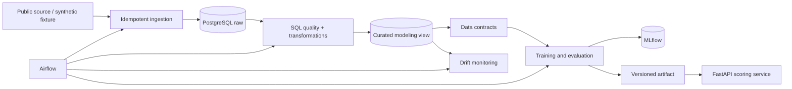
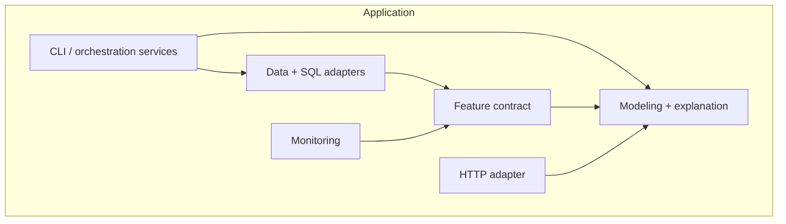

# Architecture

RiskML is a modular monolith with external PostgreSQL and MLflow services. Airflow orchestrates the
same tested application functions used by the CLI. This keeps local operation understandable while
maintaining replaceable boundaries.

The raw schema preserves source-shaped observations and explicit source identifiers. Curated SQL adds
transparent derived fields and the modeling view. One parameterized adapter loads a selected source
from that view, validates it, and exposes only the established leakage-safe raw feature contract plus
target to training. Portfolio-wide SQL aggregates and ranks stay outside the model vector. Python owns
the split and learned preprocessing. A serialized pipeline is the sole serving artifact, preventing
training-serving skew. See ADRs for decisions and `docs/architecture/azure.md` for the cloud boundary.

