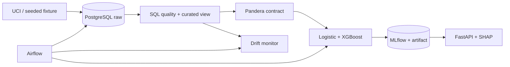

# RiskML Platform — Production Credit Risk Machine Learning

An end-to-end, SQL-first credit-default platform demonstrating reproducible data engineering,
leakage-safe machine learning, experiment tracking, explainable scoring, orchestration, and drift
monitoring.

## What it demonstrates

RiskML turns the public UCI Statlog German Credit dataset into a versioned model and bounded REST
service. PostgreSQL is a real modeling layer rather than storage decoration: migrations establish
constraints and indexes, and the curated view uses CTEs, grouped aggregates, a join, window functions,
conditional features, a subquery, and null-safe ratios. Python owns validation and learned transforms.



## Verified model result

The latest local run used all 1,000 official UCI rows, a fixed stratified 75/25 split, and no
hyperparameter search on the test set. Logistic regression achieved ROC-AUC **0.7496**, average
precision **0.5515**, and Brier score **0.1994**. Balanced XGBoost achieved ROC-AUC **0.7353**,
average precision **0.5432**, Brier score **0.1975**, and F1 **0.5269** at threshold 0.5. The baseline
ranks slightly better; XGBoost is retained as the explanation-capable comparator, not falsely called
the winner. These generated metrics predate the canonical database-loader repair; the selected rows,
features, split, and model code are unchanged, but reproduction through the repaired container path is
an independent acceptance item. See `docs/evaluation-report.md` for confusion matrices and costs.

The 1994 dataset is small and geographically/historically narrow. These are reproducibility results,
not evidence of suitability for lending. Age and foreign-worker attributes raise fairness and legal
concerns; this software must not influence real credit decisions.

## Stack and skill signals

- Data: PostgreSQL 16, SQLAlchemy, Alembic, pandas, NumPy, Pandera, substantial SQL
- ML: scikit-learn pipelines, logistic regression, XGBoost, calibration/Brier analysis, SHAP
- MLOps: MLflow, Airflow 3, deterministic fixtures, drift/reference profiling
- Service: FastAPI, Pydantic, structured logs, correlation IDs, bounded batch scoring
- Delivery: Ruff, mypy, pytest/coverage, pre-commit, Docker/Compose, GitHub Actions, Azure Bicep

## Quick start

Python 3.12 is required. The supported reproducibility path runs application commands in Linux
containers, including on Windows hosts where Application Control blocks compiled Python extensions.

```bash
docker compose up -d postgres mlflow
docker compose run --rm cli python -m alembic upgrade head
docker compose run --rm cli risk-ml download-uci --output data/processed/uci_credit.csv
docker compose run --rm cli risk-ml ingest \
  --input data/processed/uci_credit.csv --source uci-statlog-german-credit-144
docker compose run --rm cli risk-ml transform
docker compose run --rm cli risk-ml train \
  --model all --source uci-statlog-german-credit-144
docker compose up -d api
curl http://localhost:8000/health
curl http://localhost:8000/ready
```

The UCI download needs network access. The deterministic offline alternative uses `risk-ml fixture`
followed by ingestion and training with `--source synthetic-fixture`; provenance is never inferred
from a filename. Detailed prediction, monitoring, native-development, and recovery commands are in
the local operations runbook.

## API

Liveness is independent of model readiness. `/ready` returns 503 until a compatible trusted artifact
loads. The process loads that artifact once and never logs request bodies. API images contain no model
artifacts: Compose and Azure supply the trusted champion through read-only runtime mounts.

```bash
curl http://localhost:8000/health
curl -X POST http://localhost:8000/api/v1/predict \
  -H 'Content-Type: application/json' \
  -d '{
    "age": 35, "credit_amount": 3500, "duration_months": 24,
    "installment_rate": 3, "existing_credits": 1, "dependents": 1,
    "checking_status": "low", "credit_history": "existing_paid",
    "purpose": "car", "savings_status": "medium",
    "employment_duration": "medium", "housing": "own",
    "foreign_worker": true
  }'
```

A verified smoke response had the contract:

```json
{"probability": 0.5786790848, "predicted_default": true, "threshold": 0.5, "model_version": "0.1.0"}
```

`POST /api/v1/predict/batch` accepts 1–100 records by default. `POST /api/v1/explain` returns the
largest transformed-feature SHAP contributions and states that they are non-causal.

## Data, SQL, experiments, and monitoring

The official dataset is [UCI Statlog German Credit](https://doi.org/10.24432/C5NC77), licensed CC BY
4.0. Raw/downloaded data is ignored. The selected contract maps 13 of 20 source attributes plus the
target; the mapping and rejected alternatives are recorded in ADR 0002.

Canonical training reads an explicitly selected source from `curated.credit_modeling`; it never
rereads the downloaded CSV. The loader validates the frame but selects only the 13 established raw
features and target. Whole-dataset SQL aggregates, ranks, and ratios remain analytical columns rather
than model inputs, preventing held-out distribution information from entering training. MLflow records
the exact source identifier, curated relation, parameters, metrics, evaluation files, and model
artifact. The Compose MLflow UI is available at `http://localhost:5000`.

Run `python -m risk_ml.cli monitor` for a stable comparison and add `--simulate-shift` for the clearly
labeled offline drift demonstration. The controlled shift detects `credit_amount` (PSI 5.2698) and
`checking_status` (total variation 0.7983); this is data drift simulation, not concept drift or live
production monitoring.

## Testing and delivery status

Canonical checks are `make lint`, `make type`, `make test`, and `make test-integration`. The acceptance
repair's local non-integration run collected 38 tests: 36 passed, the Airflow runtime import was skipped
on native Windows, and one PostgreSQL integration test was deselected. Branch-aware coverage was
90.29%. The suite exercises curated-frame loading, explicit lineage, validation failures, leakage
defense, split-before-fit training, MLflow metadata, serialization, SHAP, API contracts and limits,
Airflow structure, monitoring, UCI mapping, and CLI behavior.

CI definitions add a PostgreSQL service job, clean migration cycle, API and CLI image builds, profiled Compose
validation, secret scanning, installed-environment dependency audit, and a dedicated Airflow job.
Reported run #2 passed quality, PostgreSQL integration, and Airflow, and proved the API build passed
the former missing-artifact point. The current acceptance repair still requires independent CI and
clean-room verification.

Azure Bicep targets Container Apps, PostgreSQL Flexible Server, Blob Storage, and Log Analytics using
GitHub OIDC. It is Azure-ready but **not deployed**; credentials, subscription/region approval,
network completion, and billable-resource approval are external blockers.

## Documentation map

- `ARCHITECTURE.md` and `docs/architecture/azure.md`: system and deployment boundaries
- `docs/sql-guide.md` and `docs/data-dictionary.md`: SQL evidence and feature meanings
- `docs/evaluation-report.md` and `docs/model-card.md`: measured behavior and limitations
- `docs/data-quality-report.md`: verified source quality and validation policy
- `docs/runbooks/`: local operations, monitoring, deployment, and rollback
- `docs/adr/`: dataset, stack, architecture, and deployment decisions
- `docs/FINAL_AUDIT.md`: adversarial self-review and residual risks

## Repository structure

Production code is under `src/risk_ml`; SQL is under `sql`; migrations under `alembic`; the Airflow DAG
under `airflow/dags`; infrastructure under `infra`; tests are split into unit and PostgreSQL integration
suites. Downloaded data, model artifacts, MLflow state, databases, secrets, and service runtime files
are intentionally ignored.

Security policy and disclosure guidance are in `SECURITY.md`. Remaining work is external acceptance,
private Azure networking, and smoke-testing an approved Azure deployment.

