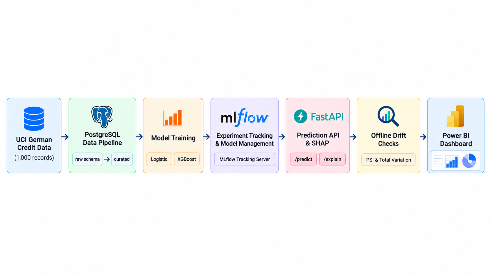
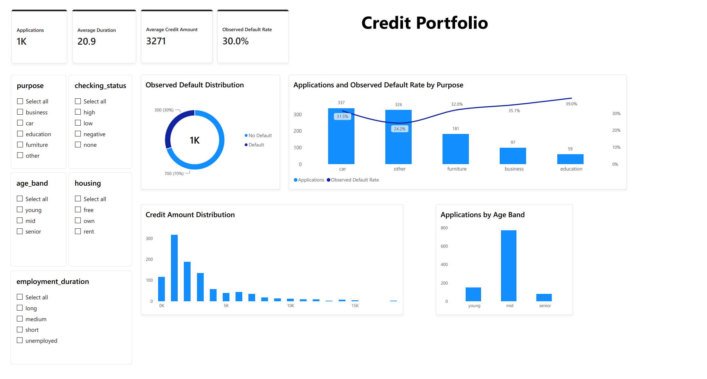
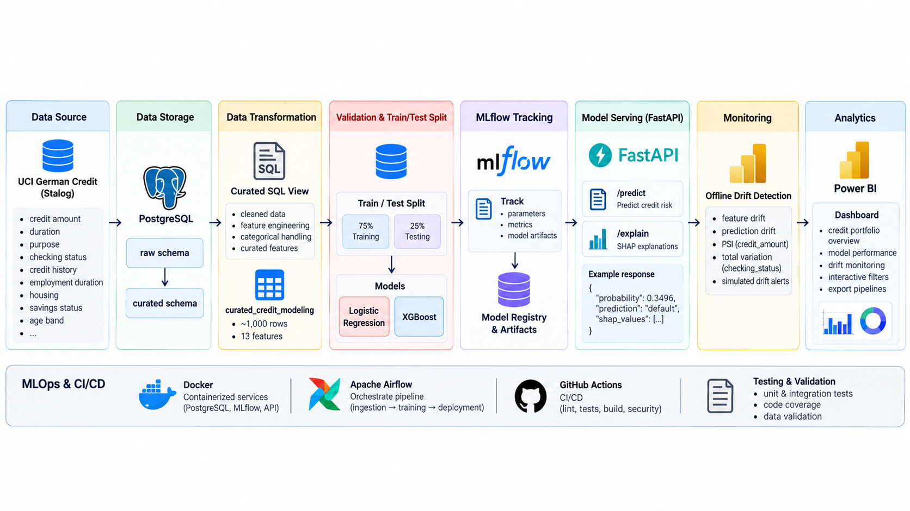
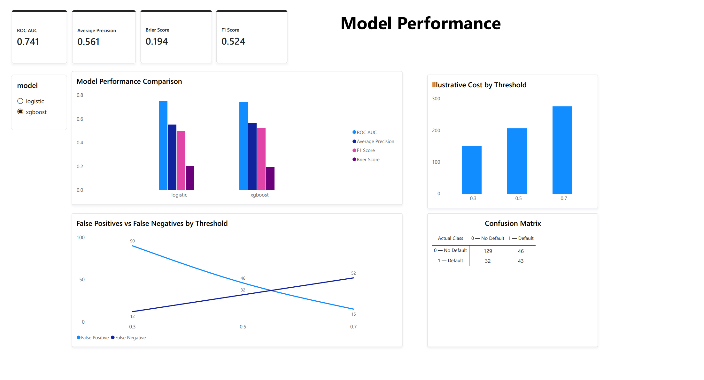
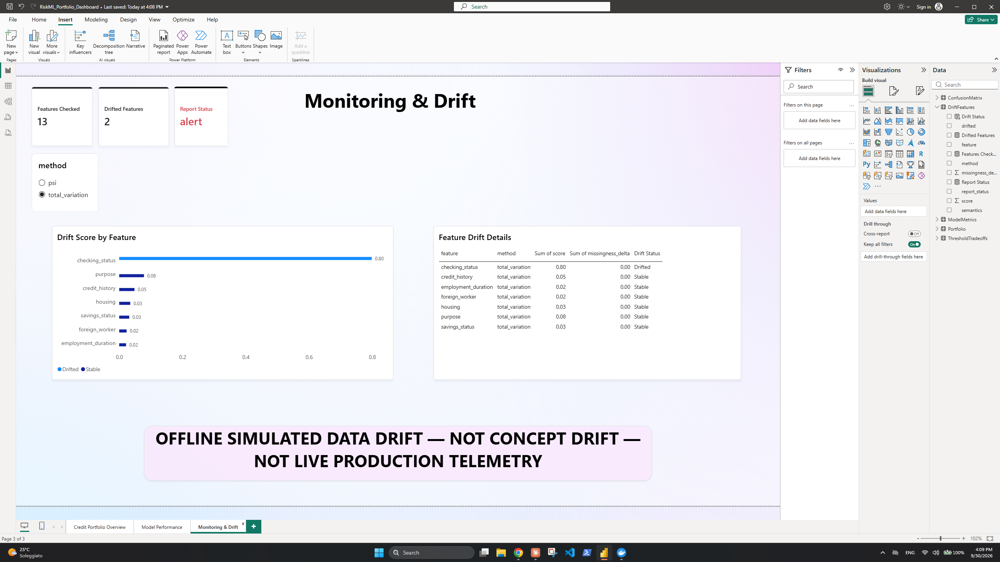

# RiskML Platform — Production Credit Risk Machine Learning

RiskML is an end-to-end, SQL-first credit-default portfolio project spanning reproducible data
engineering, leakage-safe ML, tracking, explainable serving, offline drift analysis, and Power BI. Its
independently reproduced container path is a technical showcase, not a production lending system.

## Verified at a glance

| Area | Verified evidence |
|---|---|
| Dataset | 1,000 official UCI German Credit rows |
| Split | 750 training / 250 test rows |
| Models | Logistic Regression and XGBoost |
| Data layer | PostgreSQL and `curated.credit_modeling` SQL view |
| Validation | Pandera |
| Tracking | MLflow |
| Serving | FastAPI |
| Explainability | SHAP |
| Monitoring | Offline simulated data drift |
| Presentation | Power BI |
| Coverage | 87.96% branch-aware |
| Reproduction | Clean-room Docker path verified |
| CI | [GitHub Actions run #8](https://github.com/saeedzns/riskml-platform/actions/runs/36736313203) passed |

## Project at a glance

RiskML moves verified credit data from PostgreSQL through model training, MLflow tracking, FastAPI
serving, offline drift checks, and Power BI presentation.



## Dashboard preview



The dashboard is a downstream presentation of curated and generated evidence; it does not feed the
ML pipeline or make decisions.

## Verified model results

The canonical clean-room run used all 1,000 rows from explicit source
`uci-statlog-german-credit-144`, loaded from `curated.credit_modeling`. A fixed seeded stratified
75/25 split produced 750 training rows and 250 test rows; learned transforms were fitted only after
the split.

| Fixed-split metric | Logistic regression | XGBoost |
|---|---:|---:|
| ROC-AUC | 0.7495619047619048 | 0.7412571428571428 |
| Average precision | 0.5514983321183476 | 0.5613835063550652 |
| Brier score (lower is better) | 0.19942018644912224 | 0.19416143000125885 |
| F1 at threshold 0.5 | 0.49710982658959535 | 0.524390243902439 |

Logistic regression has the higher ROC-AUC. XGBoost has higher average precision and F1 and a lower
Brier score in this fixed evaluation. XGBoost is the explanation-capable champion artifact used by
the API. See
[`docs/evaluation-report.md`](docs/evaluation-report.md) for interpretation and limitations.

## Detailed architecture



PostgreSQL is a modeling layer rather than storage decoration: migrations enforce the raw contract,
while the curated view uses CTEs, grouped aggregates, joins, window functions, conditional features,
subqueries, and null-safe ratios. Python owns validation and learned transforms. The serving path is
read-only and stateless; monitoring is offline univariate data drift only; and Power BI is downstream
of the ML system.

## Analytics & Power BI presentation

Power BI is a downstream presentation layer over curated portfolio data and generated evaluation and
drift evidence. It does not participate in model training, model feature engineering, model selection,
threshold selection, inference, SHAP computation, or production decision logic. The reproducible
export contains 1,000 portfolio rows, 2 model-metric rows, 6 threshold-tradeoff rows, 8
confusion-matrix cells, and 13 drift-feature rows.

### Credit Portfolio Overview


Describes 1,000 applications, the 30% observed default rate, average credit amount and duration, and
portfolio slices by purpose, checking status, age band, housing, and employment. These are descriptive
associations only and must not be interpreted causally.

### Model Performance



Compares Logistic Regression and XGBoost on the fixed evaluation split, including metric cards,
confusion matrices, false-positive/false-negative threshold tradeoffs, and an illustrative cost. It is
not live or production performance, and the illustrative cost is not a validated business loss
function.

### Monitoring & Drift



Shows 13 checked features and the two controlled alerts: `credit_amount` via PSI and
`checking_status` via total variation.

> **OFFLINE SIMULATED DATA DRIFT — NOT CONCEPT DRIFT — NOT LIVE PRODUCTION TELEMETRY**

Presentation resources:

- [Portfolio dashboard PDF](dashboard/RiskML_Portfolio_Dashboard.pdf)
- [Dashboard data dictionary and export guide](dashboard/README.md)
- [Three-page Power BI design specification](dashboard/POWER_BI_DESIGN.md)

## Stack and skill signals

- Data: PostgreSQL 16, SQLAlchemy, Alembic, pandas, NumPy, Pandera, substantial SQL
- ML: scikit-learn pipelines, logistic regression, XGBoost, calibration/Brier analysis, SHAP
- MLOps: MLflow, Airflow 3, deterministic fixtures, reference profiling, offline drift checks
- Service: FastAPI, Pydantic, structured logs, correlation IDs, bounded batch scoring
- Analytics / presentation: Power BI, DAX, Power Query, reproducible dashboard CSV exports
- Delivery: Ruff, mypy, pytest/coverage, pre-commit, Docker/Compose, GitHub Actions, Azure Bicep

## Quick start

Python 3.12 is required. The supported reproducibility path runs application commands in Linux
containers, including on Windows hosts where Application Control blocks compiled Python extensions.

```bash
docker compose up -d postgres mlflow
docker compose run --rm cli python -m alembic upgrade head
docker compose run --rm cli risk-ml download-uci --output data/processed/uci_credit.csv
docker compose run --rm cli risk-ml ingest \
  --input data/processed/uci_credit.csv --source uci-statlog-german-credit-144
docker compose run --rm cli risk-ml transform
docker compose run --rm cli risk-ml train \
  --model all --source uci-statlog-german-credit-144
docker compose up -d api
curl http://localhost:8000/health
curl http://localhost:8000/ready
```

The UCI download needs network access. The deterministic offline alternative uses `risk-ml fixture`
followed by ingestion and training with `--source synthetic-fixture`; provenance is never inferred
from a filename. Detailed prediction, monitoring, native-development, and recovery commands are in
the [local operations runbook](docs/runbooks/local-operations.md).

## API

Liveness is independent of model readiness. `/ready` returns 503 until a compatible trusted artifact
loads. The process loads that artifact once and never logs request bodies. API images contain no model
artifacts: Compose and Azure supply the trusted champion through read-only runtime mounts.

```bash
curl http://localhost:8000/health
curl -X POST http://localhost:8000/api/v1/predict \
  -H 'Content-Type: application/json' \
  -d '{
    "age": 35, "credit_amount": 3500, "duration_months": 24,
    "installment_rate": 3, "existing_credits": 1, "dependents": 1,
    "checking_status": "low", "credit_history": "existing_paid",
    "purpose": "car", "savings_status": "medium",
    "employment_duration": "medium", "housing": "own",
    "foreign_worker": true
  }'
```

The independently reproduced clean-room smoke response was:

```json
{
  "probability": 0.3495951294898987,
  "predicted_default": false,
  "threshold": 0.5,
  "model_version": "0.1.0"
}
```

This single response verifies the serving path and contract, not model quality. `POST
/api/v1/predict/batch` accepts 1–100 records by default. `POST /api/v1/explain` returns the largest
transformed-feature SHAP contributions and states that they are non-causal.

## Data, SQL, experiments, and monitoring

The official dataset is [UCI Statlog German Credit](https://doi.org/10.24432/C5NC77), licensed CC BY
4.0. Raw/downloaded data is ignored. The selected contract maps 13 of 20 source attributes plus the
target; the mapping and rejected alternatives are recorded in ADR 0002.

Canonical training reads an explicitly selected source from `curated.credit_modeling`; it never
rereads the downloaded CSV. The loader validates the frame but selects only the 13 established raw
features and target. Whole-dataset SQL aggregates, ranks, and ratios remain presentation-only
analytical columns rather than model inputs, preventing held-out distribution information from
entering training. MLflow records the exact source identifier, curated relation, parameters, metrics,
evaluation files, and model artifact. Clients upload artifacts through the MLflow server proxy; they
do not share its filesystem. The Compose MLflow UI is available at `http://localhost:5000`.

Run `python -m risk_ml.cli monitor` for a stable comparison and add `--simulate-shift` for the clearly
labeled offline drift demonstration. The controlled shift detects `credit_amount` (PSI 5.2698) and
`checking_status` (total variation 0.7983); this is univariate data-drift simulation, not concept
drift or live production monitoring.

## Testing and acceptance evidence

Canonical checks are `make lint`, `make type`, `make test`, and `make test-integration`. The current
analytics-layer verification produced:

- 51 non-integration tests passed, 1 POSIX-only Airflow runtime test skipped, and 2 tests deselected
- 87.96% branch-aware coverage against the enforced 75% threshold
- 2 PostgreSQL integration tests passed
- API, CLI, and MLflow image builds passed
- profiled Compose validation passed
- Gitleaks and installed-environment `pip-audit` passed
- live MLflow tracking and proxied cross-container artifact upload, listing, and download passed
- clean-room Docker reproduction and the Power BI export layer were verified
- the 1,000-row dashboard export produced counts of 1,000 / 2 / 6 / 8 / 13

Independent acceptance verified official UCI ingestion, PostgreSQL migrations, source-specific
idempotent ingestion, `curated.credit_modeling`, database-backed Logistic and XGBoost training, MLflow
tracking and artifact proxying, the champion artifact, read-only FastAPI serving, `/health`, `/ready`,
prediction, SHAP explanation, offline drift simulation, the Power BI export layer, and clean-room
Docker reproduction.

[GitHub Actions run #8 passed all jobs](https://github.com/saeedzns/riskml-platform/actions/runs/36736313203),
including quality, PostgreSQL integration, Airflow DAG validation, container builds, and security
checks.

## Deployment status and limitations

Azure Bicep targets Container Apps, PostgreSQL Flexible Server, Blob Storage, and Log Analytics using
GitHub OIDC. The infrastructure is Azure-ready but **not deployed**. Deployment is optional and is not
a blocker to the verified local/containerized portfolio project; it still requires owner-provided
credentials, subscription and region selection, networking decisions, and approval for billable
resources.

The 1994 dataset is small and geographically and historically narrow, and it has no reliable time
axis, so the split is not temporal. Age and foreign-worker attributes raise fairness and legal
concerns; this software must not influence real credit decisions. There is no external validation,
fairness or lending-compliance assessment, authenticated production ingress, delayed-label loop,
live production telemetry, concept-drift detection, or business-validated threshold cost. These
limitations preclude production lending use.

## Documentation map

- [`ARCHITECTURE.md`](ARCHITECTURE.md) and
  [`docs/architecture/azure.md`](docs/architecture/azure.md): system and deployment boundaries
- [`docs/sql-guide.md`](docs/sql-guide.md) and
  [`docs/data-dictionary.md`](docs/data-dictionary.md): SQL evidence and feature meanings
- [`docs/evaluation-report.md`](docs/evaluation-report.md) and
  [`docs/model-card.md`](docs/model-card.md): measured behavior and limitations
- [`docs/data-quality-report.md`](docs/data-quality-report.md): verified source quality and validation
  policy
- [`docs/images/riskml-project-summary.png`](docs/images/riskml-project-summary.png): compact project
  flow
- [`docs/images/riskml-detailed-architecture.png`](docs/images/riskml-detailed-architecture.png):
  detailed technical architecture
- [`dashboard/README.md`](dashboard/README.md): dashboard datasets and relationships
- [`dashboard/POWER_BI_DESIGN.md`](dashboard/POWER_BI_DESIGN.md): three-page presentation design
- [`dashboard/RiskML_Portfolio_Dashboard.pdf`](dashboard/RiskML_Portfolio_Dashboard.pdf): exported
  portfolio presentation
- [`docs/runbooks/`](docs/runbooks/): local operations, monitoring, deployment, and rollback
- [`docs/adr/`](docs/adr/): dataset, stack, architecture, and deployment decisions
- [`docs/FINAL_AUDIT.md`](docs/FINAL_AUDIT.md): adversarial self-review and residual risks

## Repository structure

Production code is under `src/risk_ml`; SQL is under `sql`; migrations are under `alembic`; the
Airflow DAG is under `airflow/dags`; Power BI presentation assets are under `dashboard`;
infrastructure is under `infra`; and tests are split into unit and PostgreSQL integration suites.
Downloaded data, generated dashboard CSVs, model artifacts, MLflow state, databases, secrets, local
Power BI workbooks, and service runtime files are intentionally ignored.

Security policy and disclosure guidance are in [`SECURITY.md`](SECURITY.md).
