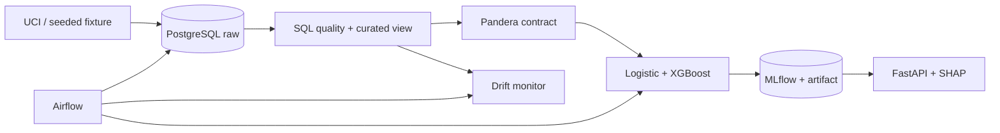

# RiskML Platform — Production Credit Risk Machine Learning

An end-to-end, SQL-first credit-default platform demonstrating reproducible data engineering,
leakage-safe machine learning, experiment tracking, explainable scoring, orchestration, and drift
monitoring.

## What it demonstrates

RiskML turns the public UCI Statlog German Credit dataset into a versioned model and bounded REST
service. PostgreSQL is a real modeling layer rather than storage decoration: migrations establish
constraints and indexes, and the curated view uses CTEs, grouped aggregates, a join, window functions,
conditional features, a subquery, and null-safe ratios. Python owns validation and learned transforms.



## Verified model result

The latest local run used all 1,000 official UCI rows, a fixed stratified 75/25 split, and no
hyperparameter search on the test set. Logistic regression achieved ROC-AUC **0.7496**, average
precision **0.5515**, and Brier score **0.1994**. Balanced XGBoost achieved ROC-AUC **0.7353**,
average precision **0.5432**, Brier score **0.1975**, and F1 **0.5269** at threshold 0.5. The baseline
ranks slightly better; XGBoost is retained as the explanation-capable comparator, not falsely called
the winner. See `docs/evaluation-report.md` for confusion matrices and threshold costs.

The 1994 dataset is small and geographically/historically narrow. These are reproducibility results,
not evidence of suitability for lending. Age and foreign-worker attributes raise fairness and legal
concerns; this software must not influence real credit decisions.

## Stack and skill signals

- Data: PostgreSQL 16, SQLAlchemy, Alembic, pandas, NumPy, Pandera, substantial SQL
- ML: scikit-learn pipelines, logistic regression, XGBoost, calibration/Brier analysis, SHAP
- MLOps: MLflow, Airflow 3, deterministic fixtures, drift/reference profiling
- Service: FastAPI, Pydantic, structured logs, correlation IDs, bounded batch scoring
- Delivery: Ruff, mypy, pytest/coverage, pre-commit, Docker/Compose, GitHub Actions, Azure Bicep

## Quick start

Python 3.12 is required. Docker is required for PostgreSQL and the complete platform.

```bash
python -m venv .venv
# Activate the environment, then:
python -m pip install -e ".[dev]"
python -m risk_ml.cli download-uci
make verify
docker compose config
docker compose up -d postgres mlflow
python -m alembic upgrade head
python -m risk_ml.cli ingest --input data/processed/uci_credit.csv
python -m risk_ml.cli transform
python -m risk_ml.cli train --model all --input data/processed/uci_credit.csv
make api
```

The UCI download needs network access. `python -m risk_ml.cli fixture` produces a deterministic,
source-compatible offline dataset instead. Detailed recovery steps are in the local operations
runbook. On this development machine Docker Compose configuration validated, but no Docker daemon was
available; container runtime and PostgreSQL integration status are stated precisely in `BLOCKERS.md`.

## API

Liveness is independent of model readiness. `/ready` returns 503 until a compatible trusted artifact
loads. The process loads that artifact once and never logs request bodies. API images contain no model
artifacts: Compose and Azure supply the trusted champion through read-only runtime mounts.

```bash
curl http://localhost:8000/health
curl -X POST http://localhost:8000/api/v1/predict \
  -H 'Content-Type: application/json' \
  -d '{
    "age": 35, "credit_amount": 3500, "duration_months": 24,
    "installment_rate": 3, "existing_credits": 1, "dependents": 1,
    "checking_status": "low", "credit_history": "existing_paid",
    "purpose": "car", "savings_status": "medium",
    "employment_duration": "medium", "housing": "own",
    "foreign_worker": true
  }'
```

A verified smoke response had the contract:

```json
{"probability": 0.5786790848, "predicted_default": true, "threshold": 0.5, "model_version": "0.1.0"}
```

`POST /api/v1/predict/batch` accepts 1–100 records by default. `POST /api/v1/explain` returns the
largest transformed-feature SHAP contributions and states that they are non-causal.

## Data, SQL, experiments, and monitoring

The official dataset is [UCI Statlog German Credit](https://doi.org/10.24432/C5NC77), licensed CC BY
4.0. Raw/downloaded data is ignored. The selected contract maps 13 of 20 source attributes plus the
target; the mapping and rejected alternatives are recorded in ADR 0002.

Run `python -m risk_ml.cli train --model all --input PATH`. MLflow records parameters, metrics,
dataset/code tags, evaluation JSON, and the trusted local artifact. Launch the UI with `mlflow ui
--backend-store-uri sqlite:///mlflow.db`.

Run `python -m risk_ml.cli monitor` for a stable comparison and add `--simulate-shift` for the clearly
labeled offline drift demonstration. The controlled shift detects `credit_amount` (PSI 5.2698) and
`checking_status` (total variation 0.7983); this is data drift simulation, not concept drift or live
production monitoring.

## Testing and delivery status

Canonical checks are `make lint`, `make type`, `make test`, and `make test-integration`. The local
non-integration suite currently has 29 collected tests (28 selected, one PostgreSQL integration test
deselected); the Airflow runtime import is skipped on native Windows and assigned to Linux CI. The
selected suite passed with 84.62% branch-aware coverage. It exercises validation failures, leakage defense,
training/serialization, ML metrics, MLflow-backed training, SHAP, API contracts and limits, Airflow DAG
import, monitoring, UCI mapping, and CLI behavior.

CI definitions add a PostgreSQL service job, clean migration cycle, API image build, Compose validation,
secret scanning, dependency audit, and a dedicated Airflow job. The first independent remote run
verified PostgreSQL integration and the dedicated Airflow DAG job; repairs for the general quality and
clean-checkout API-image jobs require confirmation by the next remote run.

Azure Bicep targets Container Apps, PostgreSQL Flexible Server, Blob Storage, and Log Analytics using
GitHub OIDC. It is Azure-ready but **not deployed**; credentials, subscription/region approval,
network completion, and billable-resource approval are external blockers.

## Documentation map

- `ARCHITECTURE.md` and `docs/architecture/azure.md`: system and deployment boundaries
- `docs/sql-guide.md` and `docs/data-dictionary.md`: SQL evidence and feature meanings
- `docs/evaluation-report.md` and `docs/model-card.md`: measured behavior and limitations
- `docs/data-quality-report.md`: verified source quality and validation policy
- `docs/runbooks/`: local operations, monitoring, deployment, and rollback
- `docs/adr/`: dataset, stack, architecture, and deployment decisions
- `docs/FINAL_AUDIT.md`: adversarial self-review and residual risks

## Repository structure

Production code is under `src/risk_ml`; SQL is under `sql`; migrations under `alembic`; the Airflow DAG
under `airflow/dags`; infrastructure under `infra`; tests are split into unit and PostgreSQL integration
suites. Downloaded data, model artifacts, MLflow state, databases, secrets, and service runtime files
are intentionally ignored.

Security policy and disclosure guidance are in `SECURITY.md`. The roadmap is limited to external
verification: complete the repaired remote CI run, run the full container stack where a Docker engine
is available, complete private Azure networking, and smoke-test an approved Azure deployment.

