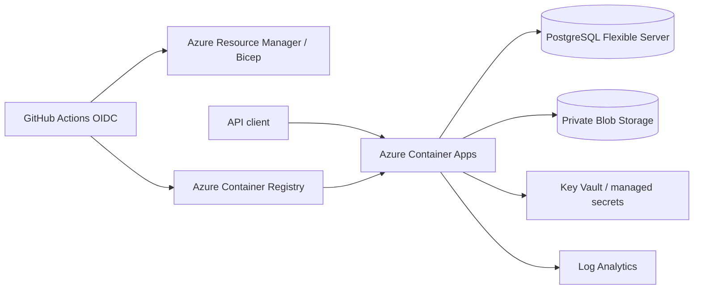

# Azure deployment architecture

Container Apps is the public TLS termination and autoscaling boundary. The champion artifact is
generated by the controlled workflow, uploaded through OIDC to a private Azure Files share, and
mounted read-only at `/models`; it is not baked into the image. The database has public access
disabled; production requires VNet integration and private DNS before deployment. Artifacts are
immutable blobs addressed by version, with credentials exposed only as Container Apps secret
references or accessed through managed identity. GitHub uses workload identity federation (OIDC),
not a stored service-principal secret.

The Bicep uses a burstable PostgreSQL server, locally redundant storage, seven-day non-production
retention, and scale-to-zero API defaults to control development cost. PostgreSQL, Log Analytics,
registry storage, and outbound traffic remain billable. The placeholder container image is replaced
by the deployment workflow only after a versioned application image exists.

